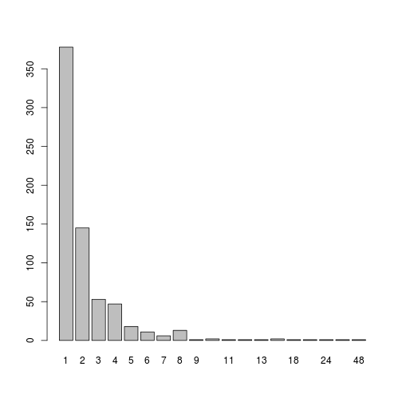
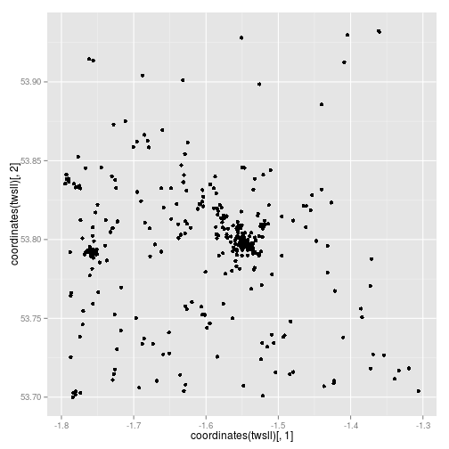
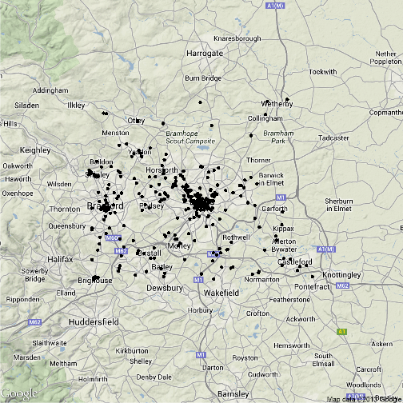
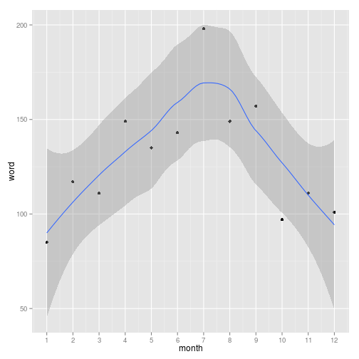

Loading and preliminary analysis of twitter data
========================================================

## Load the files
The entire twitter dataset is stored as a MYSQL database. To save only tweets that are relevant to museums, first
they were filtered, to select only tweets containing the four following character strings: exhibit, exhibition, gallery or     museum. This filter was applied to the MYSQL database, leading to a much smaller dataset that was exported as an .xls file and then conterted into .csv for loading into R. The preliminary analysis shows the basic features of this filtered dataset.


```r
tw <- read.csv("results.csv")  # load
names(tw)  # column names
```

```
##  [1] "word"                    "tweet_id"               
##  [3] "user_id"                 "X_tweet_location"       
##  [5] "Y_tweet_location"        "day"                    
##  [7] "month"                   "year"                   
##  [9] "hour"                    "minutes"                
## [11] "seconds"                 "day_of_week"            
## [13] "X_favoured_location"     "Y_favoured_location"    
## [15] "tweet_count_at_location" "text"
```

```r
nrow(tw)  # number of rows of data
```

```
## [1] 1553
```

```r
plot(tw$X_tweet_location, tw$Y_tweet_location)  # plot
```

 

```r
summary(tw$word)  # summary of the words which lead to selection
```

```
##    exhibit exhibition    gallery     museum 
##         27        207        352        967
```


Of note here is that there are only 1,553 tweets in this dataset, that we have a range of variables (location, time and text of tweet) and that the tweets are concentrated into a couple of locations (Leeds and Bradford). It is notable that 
"museum" is the word that accounts for the majority of the tweet selections (almost 2/3s), followed by "gallery", "exhibition" and finally "exhibit", which was responsible for selecting only 27 tweets.

## Analysis of textual context
This project is about museums, so it is important to estimate the proportion of tweets that are actually about museums in the dataset. To do this let's select 20 tweets at random and identify how many are museum-related manually, by reading them:


```r
set.seed(10)
tw$text[sample(tw$text, size = 20)]
```

```
##  [1] Nice visit to Leeds Museum on my own #loveancientegypt                                                                                       
##  [2] I'm at 1853 Gallery (Salts Mill_ Saltaire_ Shipley) http://t.co/XEQRHPj                                                                      
##  [3] OK_ loads of writing to do and editing of audio interviews for museum. May be away for some time...                                          
##  [4] TEDx Bradford (@ National Media Museum w/ 2 others) http://4sq.com/p1Gx4w                                                                    
##  [5] Day out (@ Royal Armouries Museum) http://t.co/FLdr5NZc                                                                                      
##  [6] When Aunty Caroline looked after Dom for the morning...  @ Abbey House Museum http://t.co/DCW2F9qi                                           
##  [7] I'm at National Media Museum w/ @daveskupski @daniel_ley http://t.co/GH5wKRTo                                                                
##  [8] @RodRhino I used to be in 6pl_ B Coy_ 1 Royal Anglain. Now got job at Regiment level interviewing lads of all eras for museum.               
##  [9] I'm at Royal Armouries Museum (Leeds_ West Yorkshire) http://t.co/JmaM0AFX                                                                   
## [10] @_VickiMiller_ @pinkcess_laurab @bantamskatee I will ask her on the day_ if not then there's always the railway museum and other places.     
## [11] Just posted a photo  @ Royal Armouries Museum http://t.co/ExVYTF0W                                                                           
## [12] Strange exhibit   @ Leeds City Museum http://t.co/nnRjmK1m                                                                                   
## [13] I'm at Leeds City Museum (Leeds_ West Yorkshire) http://t.co/rj14Dzim                                                                        
## [14] Dance Katsumi_ dance!  @ National Media Museum http://t.co/c9v49zrf                                                                          
## [15] Gallery Steps.         #gallery #art #steps #style #q8 #kuwait #beautiful #leeds #  @ Leeds City Art Gallery http://t.co/KeAnhGfC            
## [16] At the museum for some live firework making chemistry. BANG!! (@ Leeds City Museum) [pic]: http://t.co/kRiUxdPD                              
## [17] @mitchwinehouse this is such sad news. It should be made into The Museum of @AmyWinehouse &amp; that could paid to keep it. #RIPAmysHouse xxx
## [18] Dont have time to hang about on here_ I have interviews to edit for the IWM Land Warfare museum...                                           
## [19] Exhibition snooker from @judd147t some fierce shots but great cue ball control... & that double on the Black!#PureClass!                     
## [20] Invigilating the cloth and memory exhibition at work for the next 2 hours #gonnacry                                                          
## 1129 Levels: 11 AM to 3PM SUNDAY 22 APRILFine Art Exhibition Love Poem - Penelope Stutterheime 201 Portobello Road London http://t.co/0P9O8dUh ...
```

From these it seems that 2 are unrelated to museums (entries 17 and 19, one about Amy Winehouse and the other about snooker) and many others are not about visiting museums per se, rather preparing for museum interviews etc. 
Still, there are an impressive number (roughly half) that seem to be directly related to museum appreciation or visits.

## Analysis of frequency of tweets by user
It is important to know how frequently each user tweets, to see if we have enough information for 
analysing behaviour of single agents (if people tweet many times). If most people only tweet about 
museums/exhibits once, however, the dataset is far less useful to provide insight into the behaviour
of individuals over time, providing only single snapshots of different people.


```r
# analysis of frequency of tweets by user
tw$user_id <- as.factor(tw$user_id)  # convert id to factor class
summary(tw$user_id)  # summary of tweets - one tweeted 48 times
```

```
##  26526261  19825421  11813992     35853  36042554    780290  16199914 
##        48        27        24        22        18        16        16 
##  10621322  33983231  14228133  18221877  96873013 386455399  19386828 
##        13        12        11        10        10         9         8 
##  19966468  20229810  20370009  20375397  21853340  22377951  29471057 
##         8         8         8         8         8         8         8 
##  43545238  60879443  96879879 126890680 348334015   1151411   6446442 
##         8         8         8         8         8         7         7 
##  15911282  37530200 124871674 193617734  18123429  20139600  28652355 
##         7         7         7         7         6         6         6 
##  39027948 162066517 207308581 243607389 347980609 385517913 602899508 
##         6         6         6         6         6         6         6 
## 701194909   6840592   7596312  14388335  20491412  22640873  24222444 
##         6         5         5         5         5         5         5 
##  24372980  34956737  39280228  48567927  49633019  84302881  96383367 
##         5         5         5         5         5         5         5 
## 111985724 160479725 224188206 244700139 349291843     64623     79553 
##         5         5         5         5         5         4         4 
##   1220781   5677082   9748572  10064382  14524988  14786188  14868904 
##         4         4         4         4         4         4         4 
##  15602469  15726425  16192509  16817688  16946519  17646755  17977885 
##         4         4         4         4         4         4         4 
##  19018058  19552271  20393345  20627378  21218576  22379233  22922049 
##         4         4         4         4         4         4         4 
##  23597283  25491483  26816689  29090378  32486226  34907934  37889243 
##         4         4         4         4         4         4         4 
##  39557708  40243397  41086888  83091527  96752209 113699677 150987594 
##         4         4         4         4         4         4         4 
## 175703268   (Other) 
##         4       863
```

```r
ttable <- as.factor(table(tw$user_id))  # create summary
summary(ttable)  # distribution of tweets
```

```
##   1   2   3   4   5   6   7   8   9  10  11  12  13  16  18  22  24  27 
## 378 145  53  47  18  11   6  13   1   2   1   1   1   2   1   1   1   1 
##  48 
##   1
```

```r
plot(ttable)
```

 

```r
nrow(tw)/length(unique(tw$user_id))  # average number of tweets/person
```

```
## [1] 2.27
```

```r
378/1553
```

```
## [1] 0.2434
```

```r
sum(1:3 * c(378, 145, 53))/1553
```

```
## [1] 0.5325
```

```r
1:3 * as.numeric(levels(ttable))[19:17]
```

```
## [1] 48 54 72
```

```r
sum(22, 24, 27, 48)/1553
```

```
## [1] 0.07791
```

As the above analysis shows, the distribution of tweets by users is highly skewed, with the most common number of tweets
per person being 1, and tweeters who send 5 or fewer tweets accounting for just over half of all tweets. 
Those who tweet more than 20 times are rare (4 individuals) and these people account for only 8% of recorded tweets.

## Load into spatial data frame
For the next stage of analysis, we need to first load the data into a spatial dataframe.

```r
sessionInfo()  # shows packages loaded - if no geo ones, load them...
```

```
## R version 3.0.1 Patched (2013-09-13 r63932)
## Platform: x86_64-pc-linux-gnu (64-bit)
## 
## locale:
##  [1] LC_CTYPE=en_GB.UTF-8       LC_NUMERIC=C              
##  [3] LC_TIME=en_GB.UTF-8        LC_COLLATE=en_GB.UTF-8    
##  [5] LC_MONETARY=en_GB.UTF-8    LC_MESSAGES=en_GB.UTF-8   
##  [7] LC_PAPER=en_GB.UTF-8       LC_NAME=C                 
##  [9] LC_ADDRESS=C               LC_TELEPHONE=C            
## [11] LC_MEASUREMENT=en_GB.UTF-8 LC_IDENTIFICATION=C       
## 
## attached base packages:
## [1] graphics  grDevices utils     datasets  stats     methods   base     
## 
## other attached packages:
## [1] knitr_1.2       plyr_1.8        foreign_0.8-54  reshape2_1.2.2 
## [5] ggplot2_0.9.3.1
## 
## loaded via a namespace (and not attached):
##  [1] colorspace_1.2-2   dichromat_2.0-0    digest_0.6.3      
##  [4] evaluate_0.4.3     formatR_0.7        grid_3.0.1        
##  [7] gtable_0.1.2       labeling_0.1       MASS_7.3-27       
## [10] munsell_0.4        proto_0.3-10       RColorBrewer_1.0-5
## [13] scales_0.2.3       stringr_0.6.2      tools_3.0.1
```

```r
x = c("ggplot2", "sp", "rgeos", "mapproj", "rgdal", "maptools")
lapply(x, require, character.only = T)  # the R packages we'll be using
```

```
## Loading required package: sp
```

```
## Loading required package: rgeos
```

```
## rgeos version: 0.2-17, (SVN revision 392) GEOS runtime version:
## 3.3.8-CAPI-1.7.8 Polygon checking: TRUE
```

```
## Loading required package: mapproj
```

```
## Loading required package: maps
```

```
## Loading required package: rgdal
```

```
## rgdal: version: 0.8-9, (SVN revision 470) Geospatial Data Abstraction
## Library extensions to R successfully loaded Loaded GDAL runtime: GDAL
## 1.10.0, released 2013/04/24 but rgdal build and GDAL runtime not in sync:
## ... consider re-installing rgdal!! Path to GDAL shared files:
## /usr/share/gdal/1.10 Loaded PROJ.4 runtime: Rel. 4.8.0, 6 March 2012,
## [PJ_VERSION: 480] Path to PROJ.4 shared files: (autodetected)
```

```
## Loading required package: maptools
```

```
## Loading required package: grid
```

```
## Loading required package: lattice
```

```
## Note: the specification for class "im" in package 'maptools' seems
## equivalent to one from package 'sp': not turning on duplicate class
## definitions for this class.
```

```
## Note: the specification for class "owin" in package 'maptools' seems
## equivalent to one from package 'sp': not turning on duplicate class
## definitions for this class.
```

```
## Note: the specification for class "ppp" in package 'maptools' seems
## equivalent to one from package 'sp': not turning on duplicate class
## definitions for this class.
```

```
## Note: the specification for class "psp" in package 'maptools' seems
## equivalent to one from package 'sp': not turning on duplicate class
## definitions for this class.
```

```
## Checking rgeos availability: TRUE
```

```
## [[1]]
## [1] TRUE
## 
## [[2]]
## [1] TRUE
## 
## [[3]]
## [1] TRUE
## 
## [[4]]
## [1] TRUE
## 
## [[5]]
## [1] TRUE
## 
## [[6]]
## [1] TRUE
```

```r
tws <- SpatialPointsDataFrame(coords = tw[, 4:5], data = tw)
plot(tws)  # automatically plots as spatial data
```

 


To plot the data on a map, first we must change the projection:

```r
proj4string(tws)  # lacks projection info
```

```
## [1] NA
```

```r
proj4string(tws) <- CRS("+init=epsg:27700")
twsll <- SpatialPointsDataFrame(spTransform(tws, CRSobj = CRS("+init=epsg:4324")), 
    data = tws@data)
library(ggmap)
ggplot() + geom_point(aes(x = coordinates(twsll)[, 1], y = coordinates(twsll)[, 
    2]))
```

 

```r
qmap("Leeds") + geom_point(aes(x = coordinates(twsll)[, 1], y = coordinates(twsll)[, 
    2]), data = twsll@data)
```

```
## Map from URL :
## http://maps.googleapis.com/maps/api/staticmap?center=Leeds&zoom=10&size=%20640x640&scale=%202&maptype=terrain&sensor=false
```

```
## Google Maps API Terms of Service : http://developers.google.com/maps/terms
```

```
## Information from URL :
## http://maps.googleapis.com/maps/api/geocode/json?address=Leeds&sensor=false
```

```
## Google Maps API Terms of Service : http://developers.google.com/maps/terms
```

 


## Analysis of timescales of twitter data
Finally, let us look at the time period over which the data has been collected:


```r
summary(tw$year)
```

```
##    Min. 1st Qu.  Median    Mean 3rd Qu.    Max. 
##    2010    2010    2010    2010    2010    2010
```

```r
summary(tw$month)
```

```
##    Min. 1st Qu.  Median    Mean 3rd Qu.    Max. 
##    1.00    4.00    7.00    6.55    9.00   12.00
```

```r
summary(tw$day)
```

```
##    Min. 1st Qu.  Median    Mean 3rd Qu.    Max. 
##     1.0     9.0    17.0    16.3    24.0    31.0
```

```r
summary(tw$hour)
```

```
##    Min. 1st Qu.  Median    Mean 3rd Qu.    Max. 
##     0.0    12.0    14.0    13.9    16.0    23.0
```

```r
ddate <- as.Date(paste(tw$year, tw$month, tw$day, sep = "."), format = "%Y.%m.%d")
summary(ddate)
```

```
##         Min.      1st Qu.       Median         Mean      3rd Qu. 
## "2011-06-22" "2011-10-28" "2012-02-24" "2012-02-10" "2012-05-22" 
##         Max. 
## "2012-09-09"
```

```r
plot(ddate)
```

 

```r
range(ddate)
```

```
## [1] "2011-06-22" "2012-09-09"
```

```r
max(ddate) - min(ddate)
```

```
## Time difference of 445 days
```

```r
summary(as.factor(tw$hour))
```

```
##   0   1   2   3   6   7   8   9  10  11  12  13  14  15  16  17  18  19 
##  23   5   1   1   2  12  20  73 118 133 158 196 170 174  89  77 101  63 
##  20  21  22  23 
##  48  43  27  19
```

```r
sum(summary(as.factor(tw$hour))[8:16])/nrow(tw)
```

```
## [1] 0.765
```

```r
hist(tw$hour)
```

 


There is a fairly constant flow of tweets over the timespan of the data collection (445 days, from June 2011 until September 2012) as illustrated by the above scatterplot. It inspires confidence in the data 
to note that there is a strong diurnal pattern to the tweets, with the vast majority (76%) of tweets occuring 
during normal working hours of 9 am to 5 pm.


```r
twm <- melt(tw, id = c("year", "month"))
dcast(twm, formula = month ~ variable)[, 1:2]
```

```
## Aggregation function missing: defaulting to length
```

```
##    month word
## 1      1   85
## 2      2  117
## 3      3  111
## 4      4  149
## 5      5  135
## 6      6  143
## 7      7  198
## 8      8  149
## 9      9  157
## 10    10   97
## 11    11  111
## 12    12  101
```

```r
tmsum <- dcast(twm, formula = month ~ variable)[, 1:2]
```

```
## Aggregation function missing: defaulting to length
```

```r
sum(tmsum[, 2])  # correct number of tweets
```

```
## [1] 1553
```

```r
qplot(data = tmsum, x = month, y = word) + geom_smooth() + scale_x_continuous(breaks = 1:12)
```

```
## geom_smooth: method="auto" and size of largest group is <1000, so using
## loess. Use 'method = x' to change the smoothing method.
```

 

```r
dcast(twm, formula = year + month ~ variable)[, 1:3]
```

```
## Aggregation function missing: defaulting to length
```

```
##    year month word
## 1  2011     6   29
## 2  2011     7   69
## 3  2011     8   62
## 4  2011     9  139
## 5  2011    10   97
## 6  2011    11  111
## 7  2011    12  101
## 8  2012     1   85
## 9  2012     2  117
## 10 2012     3  111
## 11 2012     4  149
## 12 2012     5  135
## 13 2012     6  114
## 14 2012     7  129
## 15 2012     8   87
## 16 2012     9   18
```

From the above it seems there is a seasonal pattern to the tweets also.


